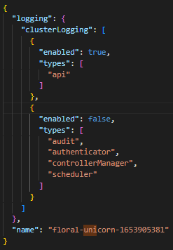
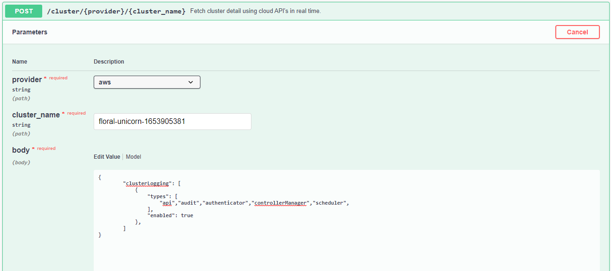

[](https://goreportcard.com/report/github.com/matos/matos)
[](https://bestpractices.coreinfrastructure.org/projects/3588)

<h1 style="text-align:center">Remediation use case development</h1>

# UseCase: 
EKS control plane logging is enabled for your Amazon EKS clusters.

# STEP 1: Get resources status and metadata from AWS using Cloud SDK APIs
**Description**: Create an api to get logging of the cluster. (Check: Swagger: **/apidocs**)

1. Fill the information for file <i>/credentials/kube_config_aws</i>
2. Change the name of <i>credentials/aws_role_account.json.sample</i> to <i>credentials/aws_role_account.json</i> and update the information for it
3. Create api to get the logging status of an AWS cluster by name
   **Endpoint**: GET <i>/cluster<provider>/<cluster_name></i>
  
  * Parameters:
    * provider: The name of the cloud provider. For the testing purpose, please always set it as **aws**
    * cluster_name: The name of the cluster you want to check the logging status. You can archive this by:
      * Login to your AWS Account
      * Go to Amazon Elastic Kubernetes Service
      * You can see a list of clusters in the right-hand table. (If no cluster existed, you can create one). Then, copy the name of the cluster you want to check

  
  * **Response**: <br>


# STEP 2: Write unit test with JSON response from Step-1
**Json data test:**
    
    /Matos/test/data/test_aws_cluster_logging_resources.json
**Python code test:**
    
    /Matos/test/data/test_aws_cluster_logging_resources.py

# STEP 3: Write a restful api to enable/disable cluster logging
**Endpoint:** POST */cluster<provider>/<cluster_name>*


    * **Parameters**:
      * provider: The name of the cloud provider. For the testing purpose, please always set it as **aws**
      * cluster_name: The name of the cluster you want to check the logging status. You can archive this by:
        * Login to your AWS Account
        * Go to Amazon Elastic Kubernetes Service
        * You can see a list of clusters in the right-hand table. (If no cluster existed, you can create one). Then, copy the name of the cluster you want to check

**Body:**

types: The name of logging types of a cluster. This type should be  **api, audit, authenticator, controllerManager, scheduler**

    Body example:
    ```
        {
        "clusterLogging": [
            {
                "types": [
                    "api","audit","authenticator","controllerManager","scheduler",
                ],
                "enabled": true
            },
        ]
        }
    ```
